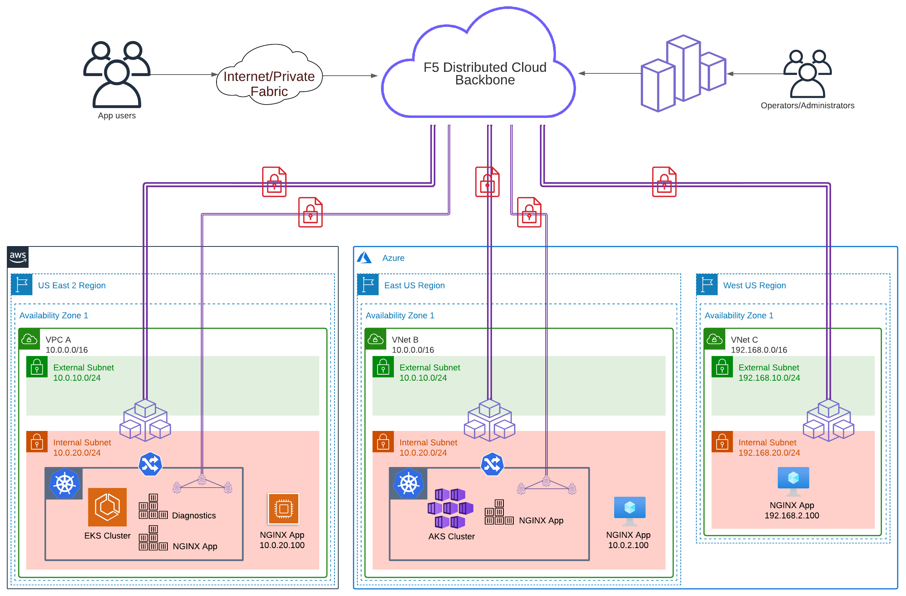

# F5 Distributed Cloud Multi-Cloud Networking (MCN) Demos

This demo will use Terraform to create [F5 Distributed Cloud Nodes](https://docs.cloud.f5.com/docs/about-f5-distributed-cloud/app-stack#f5-distributed-cloud-node) and public cloud resources in AWS, Azure, and Google. Once the multi-cloud environment is ready, you then choose a lab guide to explore the F5 Distributed Cloud (XC) platform. Manual steps will be performed in order to configure F5 XC and address common multi-cloud challenges.

The initial deployment will consist of the following:

- AWS
  - 1x VPC (10.0.0.0/16 CIDR)
  - 1x F5 XC Node
  - 1x NGINX app (EC2 instance)
  - TBD 1x EKS cluster
  - TBD 1x Diagnostics app (EKS container)
  - TBD 1x NGINX app (EKS container)
- Azure #1
  - 1x VNet (10.0.0.0/16 CIDR) - IP Overlap!!
  - 1x F5 XC Node
  - 1x NGINX app (VM instance)
  - TBD 1x AKS cluster
  - TBD 1x NGINX app (AKS container)
- Azure #2
  - 1x VNet (192.168.0.0/16 CIDR)
  - 1x F5 XC Node
  - 1x NGINX app (VM instance)
- TBD Google
  - 1x xxxx

## Configuration Example

The following is an example configuration diagram for this solution deployment.



## Scenario

ACME Corp has multiple business units that have independently migrated to AWS, Azure, and soon GCP. They are now required to communicate with each other securely and with minimal changes to existing environments. They have a few acquisitions in the near future and are concerned with the complexities that come with multi-cloud networking and connecting their services together. Some applications have been deployed without planning, and this resulted in services that are deployed in a different cloud or on networks with overlapping RFC1918 CIDRs. The services cannot be easily connected without deploying NATing and routing appliances.

The application teams are also trying to address scaling issues by hosting services in multiple locations and this has proven to be a challenge. Not only are they running virtual machine types, but there is also a mandate to run container workloads. As a result, they have copies of applications running as virtual machine instances and also Azure AKS and AWS EKS container workloads in the public cloud.

You need to solve this mess, and F5 XC Nodes can help. F5 Nodes are deployed as part of the SaaS service of F5 XC, and they will allow you to connect, secure, control and observe applications deployed within a single cloud location or applications distributed across multiple clouds and edge sites.

## Get Started

1. Deploy Terraform Code - see [Prerequisites](#prerequisites)
2. Explore Use Cases - see [Lab Guides](lab-guides/README.md)

## Prerequisites

- [F5 Distributed Cloud credentials](https://docs.cloud.f5.com/docs/how-to/user-mgmt/credentials)
- [Set AWS Environment Variables](aws/README.md#login-to-aws-environment)
- [Create Azure Service Principal](azure/README.md#login-to-azure-environment)
- [Create Google Service Account](gcp/README.md#login-to-google-environment)

## Usage Example

- Clone the repo and open the solution's directory
```bash
git clone https://github.com/JeffGiroux/f5xc-mcn.git
cd f5xc-mcn/
```

- Set F5 Distributed Cloud environment variables
```bash
export VES_P12_PASSWORD="your_key"
export VOLT_API_URL="https://<tenant-name>.console.ves.volterra.io/api"
export VOLT_API_P12_FILE="/var/tmp/<example>.console.ves.volterra.io.api-creds.p12"
```

- Get the F5 Distributed Cloud tenant name
  - F5 XC Console > Tenant Settings > Tenant Overview
- Create the tfvars file and update it with your settings
```bash
cp admin.auto.tfvars.example admin.auto.tfvars
# MODIFY TO YOUR SETTINGS
vi admin.auto.tfvars
```

- Run the initial setup script (sets up a random build suffix and a virtual site)
```bash
./setup.sh
```

- Run the cloud specifc setup script: (remember that you are responsible for the cost of those components)
```bash
./aws-setup.sh
./azure-site1-setup.sh
./azure-site2-setup.sh
./gcp-setup.sh
```

## Test Your Setup

Reference each cloud for steps to validate.
- AWS [Test your setup](aws/README.md#test-your-setup)
- Azure [Test your setup](azure/README.md#test-your-setup)
- Google [Test your setup](gcp/README.md#test-your-setup)

## Cleanup

- Run the cloud specific destroy script
```bash
./aws-destroy.sh
./azure-site1-destroy.sh
./azure-site2-destroy.sh
./gcp-destroy.sh
```

- Run the solution destroy script
```bash
./destroy.sh
```

## Troubleshooting

> See [Troubleshooting](TROUBLESHOOTING.md) document for common issues you might see when deploying this demo along with recommended fixes or alternative actions.

<!-- markdownlint-disable no-inline-html -->
<!-- BEGINNING OF PRE-COMMIT-TERRAFORM DOCS HOOK -->
## Requirements

| Name | Version |
|------|---------|
| <a name="requirement_terraform"></a> [terraform](#requirement\_terraform) | >= 1.2 |
| <a name="requirement_volterra"></a> [volterra](#requirement\_volterra) | 0.11.18 |

## Providers

| Name | Version |
|------|---------|
| <a name="provider_random"></a> [random](#provider\_random) | 3.4.3 |
| <a name="provider_volterra"></a> [volterra](#provider\_volterra) | 0.11.18 |

## Modules

No modules.

## Resources

| Name | Type |
|------|------|
| [random_id.buildSuffix](https://registry.terraform.io/providers/hashicorp/random/latest/docs/resources/id) | resource |
| [volterra_virtual_site.site](https://registry.terraform.io/providers/volterraedge/volterra/0.11.18/docs/resources/virtual_site) | resource |

## Inputs

| Name | Description | Type | Default | Required |
|------|-------------|------|---------|:--------:|
| <a name="input_f5xcTenant"></a> [f5xcTenant](#input\_f5xcTenant) | The F5 XC tenant to use. | `string` | n/a | yes |
| <a name="input_namespace"></a> [namespace](#input\_namespace) | The F5 XC namespace into which XC nodes and resources will be managed. | `string` | n/a | yes |
| <a name="input_awsRegion"></a> [awsRegion](#input\_awsRegion) | aws region | `string` | `null` | no |
| <a name="input_azureLocation"></a> [azureLocation](#input\_azureLocation) | location where Azure resources are deployed (abbreviated Azure Region name) | `string` | `null` | no |
| <a name="input_buildSuffix"></a> [buildSuffix](#input\_buildSuffix) | unique build suffix for resources; will be generated if empty or null | `string` | `null` | no |
| <a name="input_domain_name"></a> [domain\_name](#input\_domain\_name) | The DNS domain name that will be used as common parent generated DNS name of loadbalancers. Default is 'shared.acme.com'. | `string` | `"shared.acme.com"` | no |
| <a name="input_f5xcCloudCredAWS"></a> [f5xcCloudCredAWS](#input\_f5xcCloudCredAWS) | F5 XC Cloud Credential to use with AWS | `string` | `null` | no |
| <a name="input_f5xcCloudCredAzure"></a> [f5xcCloudCredAzure](#input\_f5xcCloudCredAzure) | F5 XC Cloud Credential to use with Azure | `string` | `null` | no |
| <a name="input_f5xcCloudCredGCP"></a> [f5xcCloudCredGCP](#input\_f5xcCloudCredGCP) | F5 XC Cloud Credential to use with GCP | `string` | `null` | no |
| <a name="input_gcpProjectId"></a> [gcpProjectId](#input\_gcpProjectId) | gcp project id | `string` | `null` | no |
| <a name="input_gcpRegion"></a> [gcpRegion](#input\_gcpRegion) | region where GCP resources will be deployed | `string` | `null` | no |
| <a name="input_projectPrefix"></a> [projectPrefix](#input\_projectPrefix) | prefix for resources | `string` | `"mcn-demo"` | no |
| <a name="input_resourceOwner"></a> [resourceOwner](#input\_resourceOwner) | owner of the deployment, for tagging purposes | `string` | `null` | no |
| <a name="input_ssh_key"></a> [ssh\_key](#input\_ssh\_key) | An optional SSH key to add to nodes. | `string` | `""` | no |

## Outputs

| Name | Description |
|------|-------------|
| <a name="output_buildSuffix"></a> [buildSuffix](#output\_buildSuffix) | build suffix for the deployment |
| <a name="output_f5xcVirtualSite"></a> [f5xcVirtualSite](#output\_f5xcVirtualSite) | name of virtual site across all clouds |
<!-- END OF PRE-COMMIT-TERRAFORM DOCS HOOK -->
<!-- markdownlint-enable no-inline-html -->

## Support

For support, please open a GitHub issue.  Note, the code in this repository is community supported and is not supported by F5 Networks.  For a complete list of supported projects please reference [SUPPORT.md](SUPPORT.md).

## Community Code of Conduct

Please refer to the [F5 DevCentral Community Code of Conduct](code_of_conduct.md).

## License

[Apache License 2.0](LICENSE)

## Copyright

Copyright 2014-2020 F5 Networks Inc.

### F5 Networks Contributor License Agreement

Before you start contributing to any project sponsored by F5 Networks, Inc. (F5) on GitHub, you will need to sign a Contributor License Agreement (CLA).

If you are signing as an individual, we recommend that you talk to your employer (if applicable) before signing the CLA since some employment agreements may have restrictions on your contributions to other projects.
Otherwise by submitting a CLA you represent that you are legally entitled to grant the licenses recited therein.

If your employer has rights to intellectual property that you create, such as your contributions, you represent that you have received permission to make contributions on behalf of that employer, that your employer has waived such rights for your contributions, or that your employer has executed a separate CLA with F5.

If you are signing on behalf of a company, you represent that you are legally entitled to grant the license recited therein.
You represent further that each employee of the entity that submits contributions is authorized to submit such contributions on behalf of the entity pursuant to the CLA.
