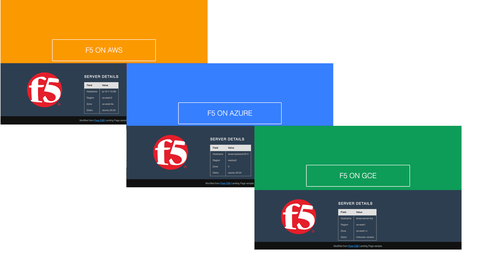

# Azure Multi-Cloud module

This module will create a set of F5 Distributed Cloud (XC) Nodes and Azure resources.

## Requirements

- Azure CLI
- Terraform
- Azure Service Principal
- F5 Distributed Cloud account and credentials

## Login to Azure Environment

- Open a terminal
- Retrieve Azure subscription and account info (example below uses [AZ CLI](https://learn.microsoft.com/en-us/cli/azure/))
```bash
# Login
az login

# Show subscriptions
az account show

# Set default
az account set -s <subscriptionId>
```

## Create Azure Service Principal

F5 XC will create resources and need access to your Azure Subscription. If you already have a service principal, you can use it. Otherwise you can follow these steps to create one.

> Note: You must have an "Owner" role for your subscription to create a service principal.

1. From the Azure Console Bash Cloud Shell, run the following command:
```
  $ az ad sp create-for-rbac -n "http://[unique-name]-f5xc-cc" --role contributor
  {
    "appId": "xxx-xxxx",
    "displayName": "[unique-name]-f5xc-cc",
    "name": "http://[unique-name]-f5xc-cc",
    "password": "[password]",
    "tenant": "yyy-yyy"
  }
```

2. Copy the JSON output (starting with "{" ending with "}") of this command and keep it safe. This credential enables read/write access to your Azure Subscription.

3. Retrieve your subscription ID. You can use the following command to list out the name, id, and whether it is your default subscription.
```
  $ az account show  --query [name,id,isDefault]
  [
    "f5-AZR_xxxx", <-- name
    "xxx-xxx-xxx", <-- subscription id
    true           <-- is this the default subscription
  ]
```

## Create F5 XC Cloud Credentials for Azure

- Set F5 XC Cloud credentials - https://docs.cloud.f5.com/docs/how-to/user-mgmt/credentials
1. Go to the "System" namespace > "Manage" -> "Site Management" -> "Cloud Credentials"
2. Click on "Add Cloud Credential"
3. For the name enter "[unique-name]-azure"
4. For the Cloud Credential Type: "Azure Client Secret for Service Principal" and enter the values based on the JSON output from before.
- Client ID: "appId" from JSON output
- Subscription ID: output of id from "account show" command
- Tenant ID: "tenant" from JSON output
5. Under Azure Client Secret click on "Configure"
6. Enter the value of "password" from the previous JSON output
7. Click on "Blindfold" and save changes

## Usage Example

See parent [README Usage Example](../README.md#usage-example), then come back here to test.

## Test Your Setup

TBD...
Browse to the NGINX application server public IP (see Terraform output). The splash page will resolve with a customized NGINX page displaying cloud provider name, region, and zone.



## Cleanup

See parent [README Cleanup scripts](../README.md#cleanup).
