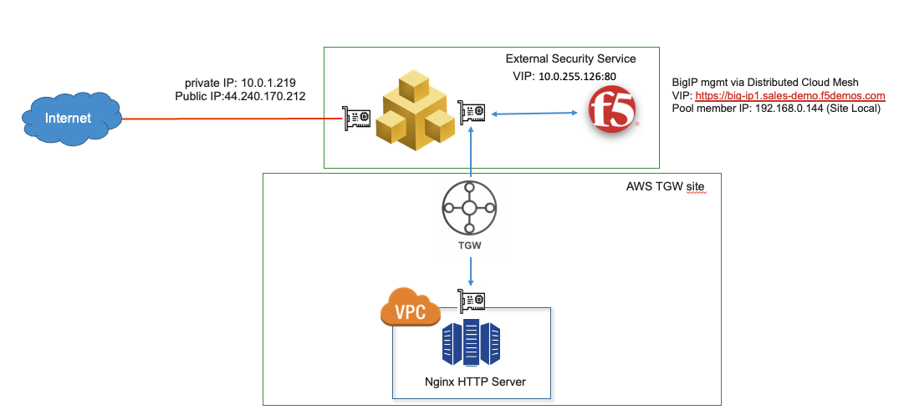

Module 1: View the BIG-IP External Site in XC Console
=====================================================

The first module of the lab will walk through the XC console configuration for the BIG-IP External site.
This module walks through External Site configuration dialogue.
Secondly, the XC Console provides traffic and resource statistics for the BIG-IP devices(s).

  - **[Lab 1: Creating an External Site](lab1.md)**