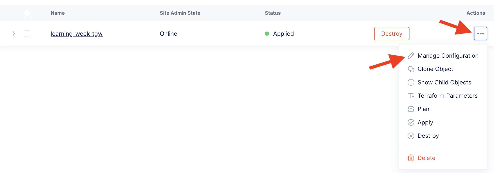

Lab 1: AWS Transit Gateway Site
==================================

Access the XC Console
----------------------

If not already running, open the UDF Blueprint ["Learning Week Walkthrough - F5XC"](https://udf.f5.com/b/c0ed9a8c-034a-4398-8729-2fb5afe66ace#documentation) and click "Deploy" to create a deployment. Then hit "Start".

> *Once you start the UDF deployment, it will create an ephemeral account on the F5 Distributed Cloud console (this may take 5-10 min). Then you will receive an email to update your password.*

Login to your assigned Distributed Cloud tenant - [F5 Sale Demo](https://f5-sales-demo.console.ves.volterra.io).

View the AWS Transit Gateway Site Configuration
-----------------------------------------------
1. From the [XC Console home](https://f5-sales-demo.console.ves.volterra.io/web/home), click the "Cloud and Edge Sites" tile.

2. In the navigation menu on the left under "Manage", select "AWS TGW Sites" under "Site Management".

3. Under the "Actions" menu, click the three dots and select "Manage Configuration".

Explore the "Services VPC", "Transit Gateway", and "Site Node Parameters" configuration.
This is an AWS Transit Gateway site -- with a single master node in this simple example.
The VPC containing the BIG-IP has been automatically attached to the TGW.

Next
----

  - **[Lab 2: View the External Site Configuration](lab2.md)**
  - **[Lab 3: View the External Site Stats](lab3.md)**