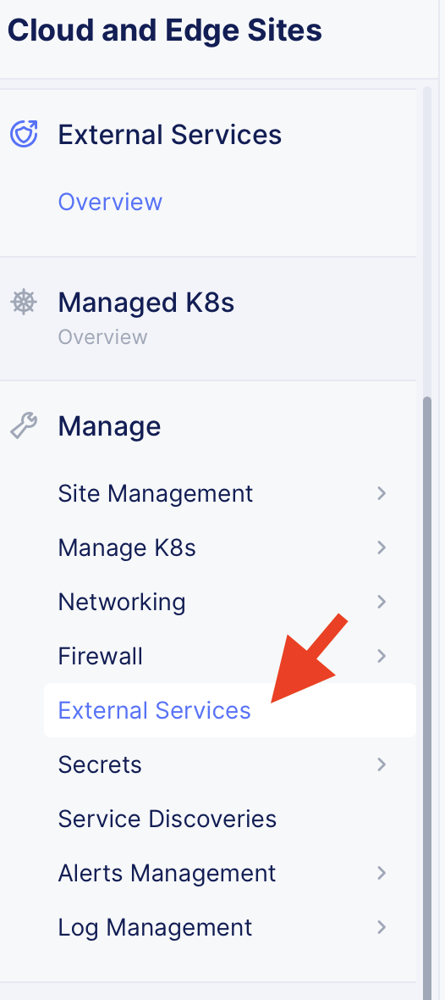
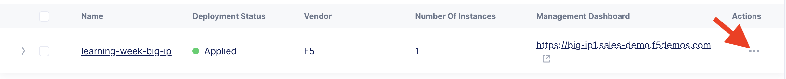
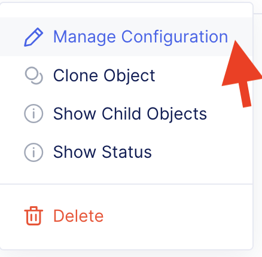
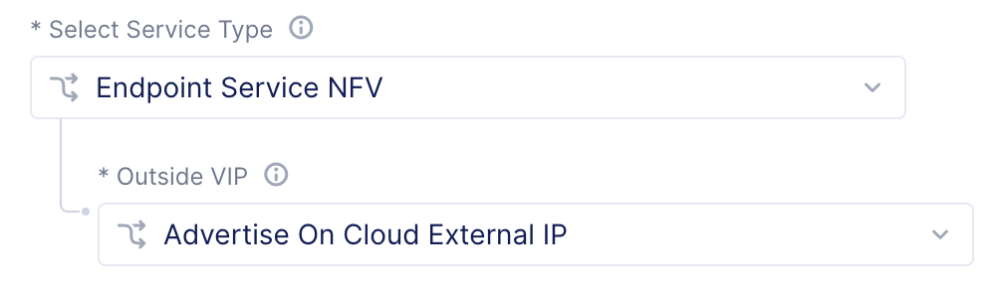
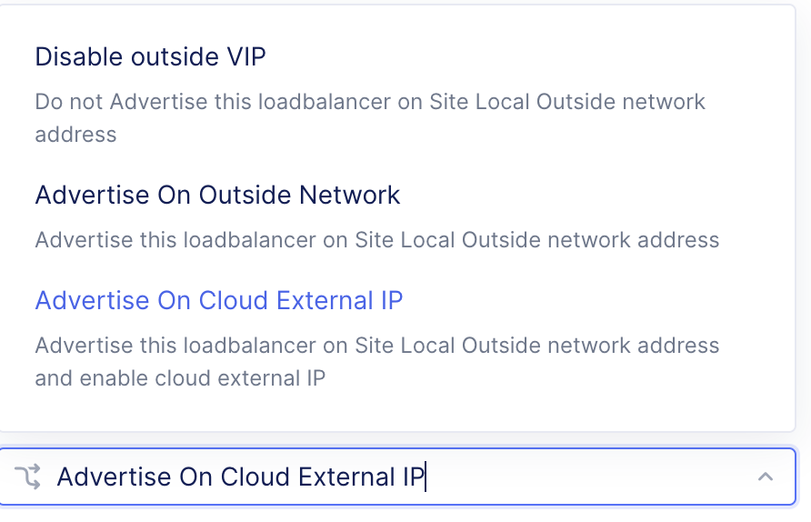
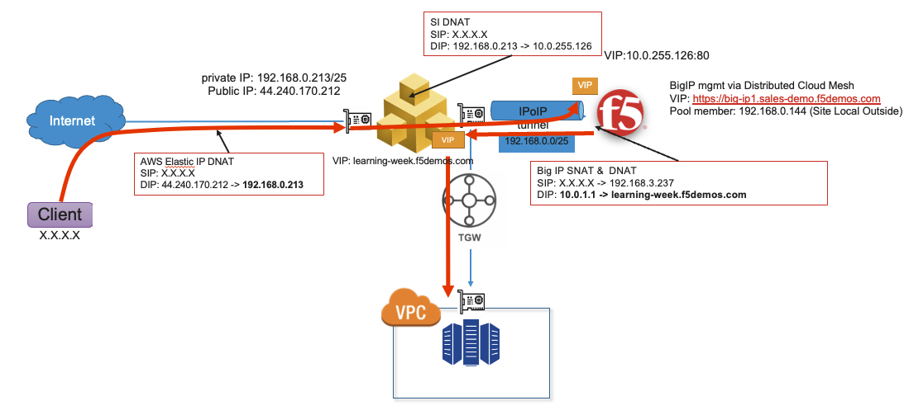

Lab 2: View the External Site Configuration
===========================================

1. From the [XC Console home](https://f5-sales-demo.console.ves.volterra.io/web/home), click the "Cloud and Edge Sites" tile.

2. In the navigation menu on the left, click "External Services" under the "Manage" menu.

3. Click the three dots on the right of the External site. Click "Manage Configuration".

From here take note of the External site configuration.
For this site we've exposed the BIG-IP manaagement interface to the internet.
The FQDN for this device is {{hostname}}.{{domain suffix}}.

We could have also exposed the BIG-IP management interface on the "site local network" of a customer edge. This would restrict access to a customer's private XC network.

For BIG-IP data plane traffic the "Endpoint Service NFV" is set to "Advertise On Cloud External IP". An AWS EIP has been created to expose the VIP.

The service NFV could also be advertised the outside network on the CE. This would be sufficient for East/West use cases or other scenarios where egress traffic comes from a VPC attached to the CE's transit gateway.

Recall the end to end packet flow for this configuration.

The NFV endpoint can be accessed [here](http://learning-week.f5demos.com/).

Next
----

  - **[Lab 3: View the External Site Stats](lab3.md)**