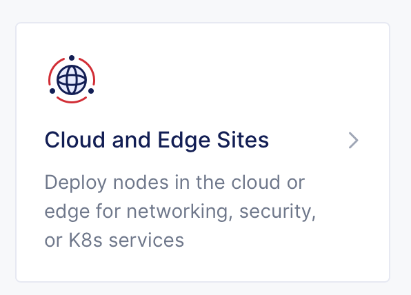

Lab 3: View the External Site Stats
===================================

1. From the [XC Console home](https://f5-sales-demo.console.ves.volterra.io/web/home), click the "Cloud and Edge Sites" tile.

2. In the navigation menu on the left, under "External Services", select "Overview"

3. Click on the External Site's name. 

Note the BIG-IP statistics included on this dashboard including service, traffic, and instance information.

Next
----

  - **[Module 2: BIG-IP Configuration](../module2/README.md)**
