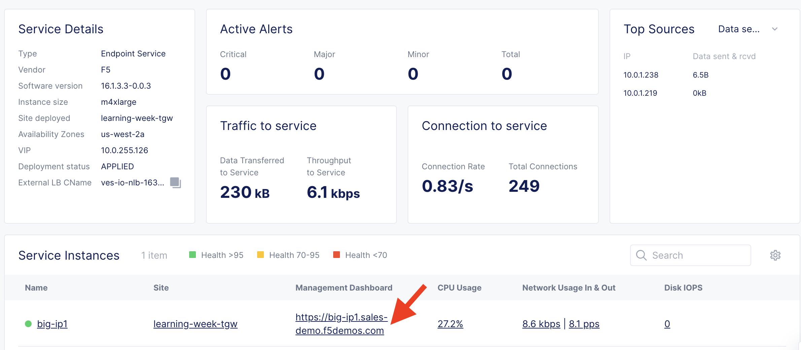
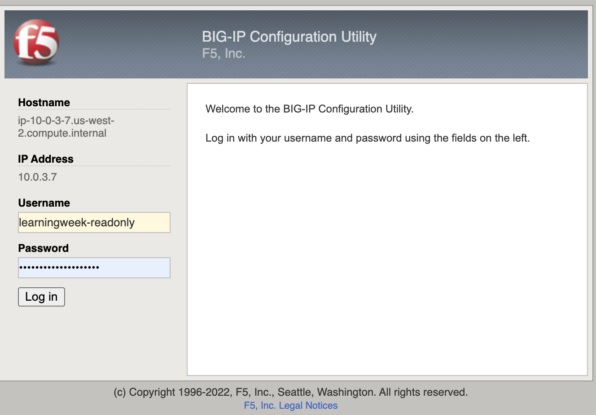

Lab 1: Access the BIG-IP Management Interface
==========================================

1. Find the BIG-IP management interface FQDN in the XC Console.

You'll recall the FQDN was available on the [External Service Overview Dashboard](https://f5-sales-demo.console.ves.volterra.io/web/workspaces/cloud-and-edge-sites/external_services/overview/learning-week-big-ip/dashboard).

([Hint](https://big-ip1.sales-demo.f5demos.com/tmui/login.jsp))

2. Login to the BIG-IP device with the credentials given in the [UDF deployment description](https://udf.f5.com/b/c0ed9a8c-034a-4398-8729-2fb5afe66ace#documentation).

Next
----

  - **[Lab 2: View the Virtual Server Configuration](lab2.md)**