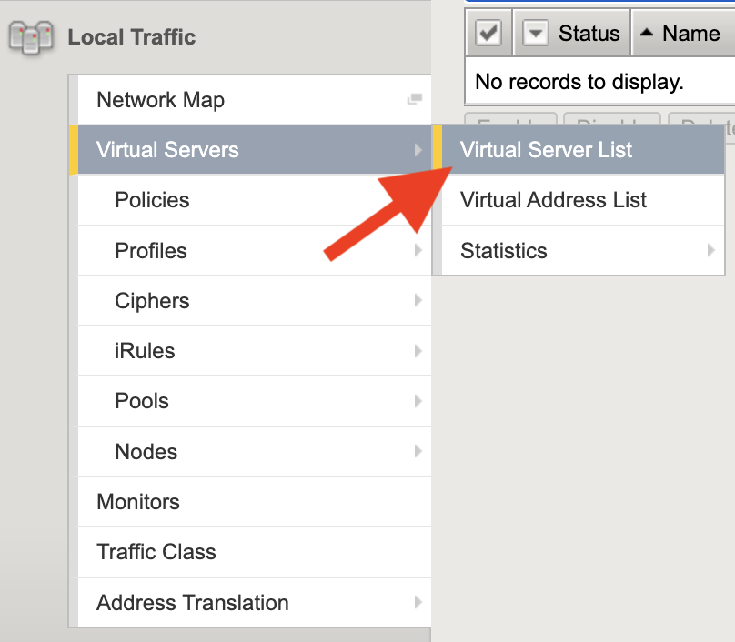
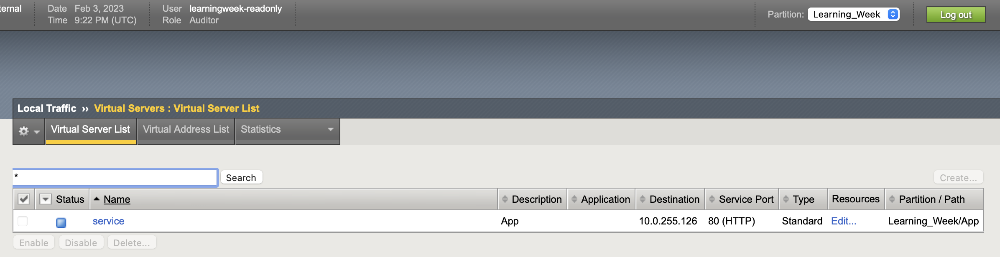
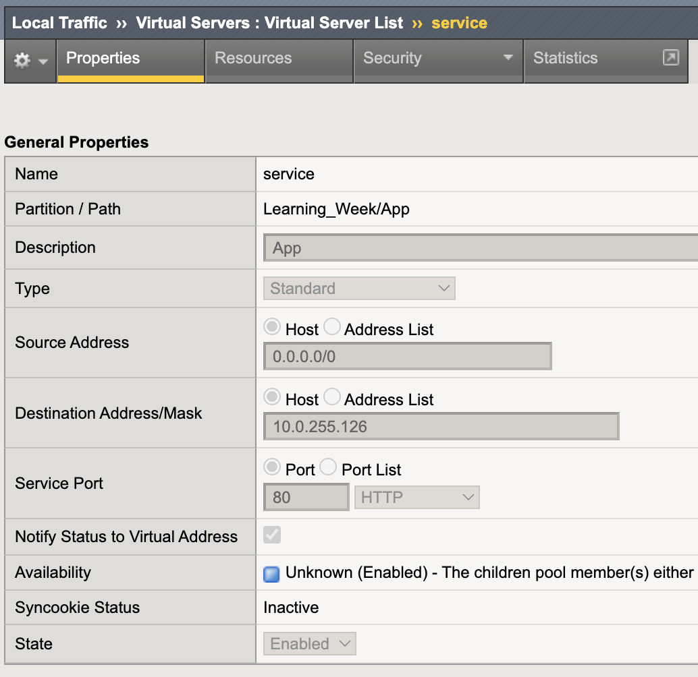
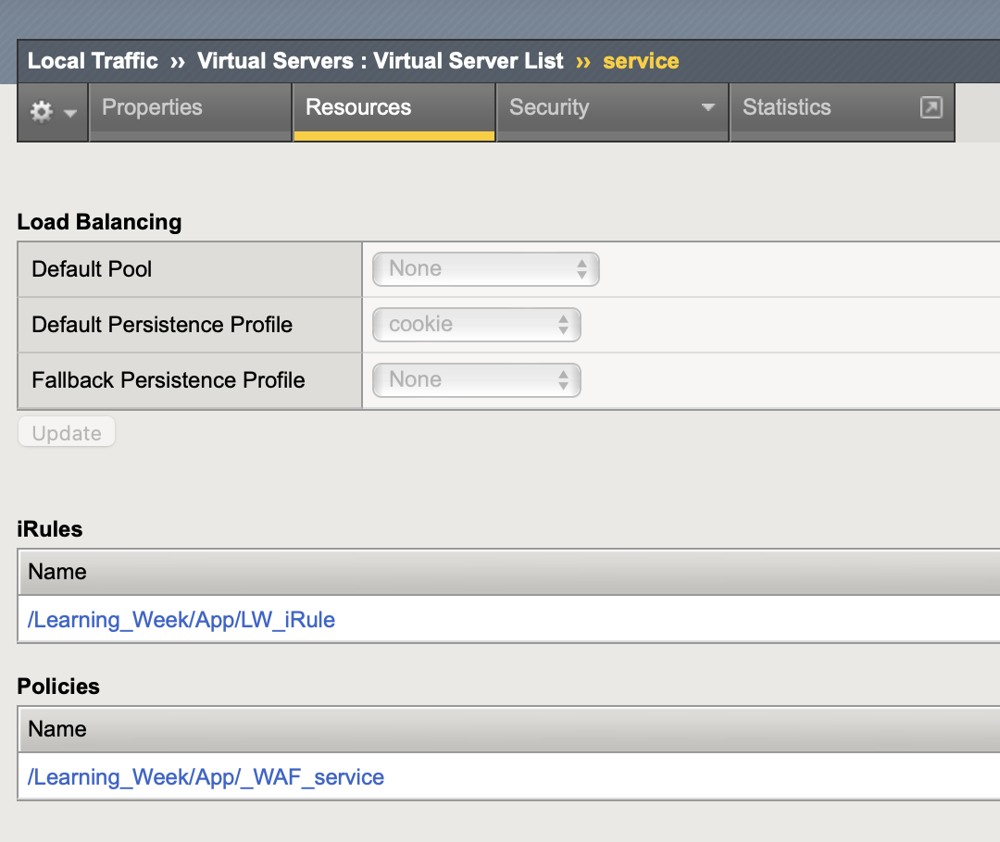

Lab 2: View the Virtual Server Configuration
=============================================

1. Navigate to the BIG-IPs virtual server configuration. Note the virtual server is in the "Learning_Week" partition.

2. View the "service" virtual server details.

3. Feel free to explore additional BIG-IP configuration. The provided account is read only.

The virtual server was created with this simple AS3 declaration.

