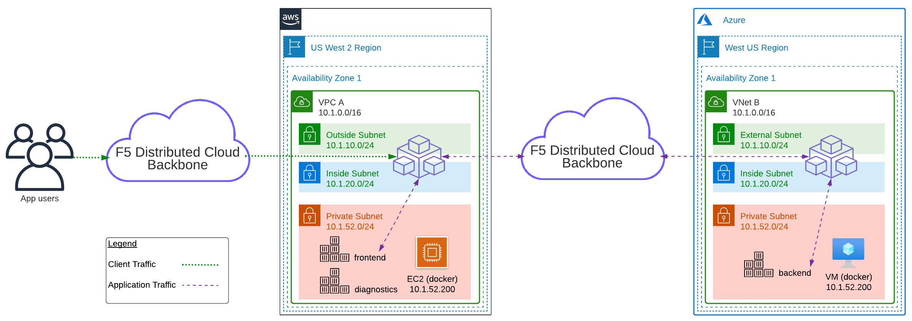

Introduction to the Lab
=======================

During the lab, you will be emulating a customer that needs to expose an application running in AWS and Azure. The goal is to securely connect the application services between cloud environments. The "frontend" demo application runs on an AWS EC2 instance and is exposed to the internet. The "backend" demo application runs on an Azure VM instance, and it is internal only.

Lab Environment
---------------

The infrastructure resources in AWS and Azure have been pre-built with Terraform including networks, security groups, DNS, and virtual machine instances running the demo app (frontend/backend) and diagnostics app (client). You will use F5 Distributed Cloud to create additional services and complete the lab guide.

> For demo purposes, the F5 Distributed Cloud nodes in AWS and Azure have been pre-built. This is to simplify the lab and avoid the requirement for user to need public cloud credentials. In addition, it helps with overall lab clean up of F5 Distributed Cloud resources.

Narrative
---------

In this example we are starting with an application running in AWS.

The "frontend" application has a requirement that it must be able to communicate with the "backend". The "backend" could be a database legacy system, etc.

The goal is to extend the environment into Azure and still allow the AWS "frontend" to connect to the Azure "backend". The following topology illustrates Distributed Cloud Mesh nodes deployed in both AWS and Azure environments as well as NGINX web servers running a simple demo application.

Once the AWS and Azure cloud environments are ready, you will deploy Distributed Cloud Mesh sites in both clouds. Then you create an F5 Distributed Cloud HTTP Load Balancer to allow clients to connect publicly from a Regional Edge (AnyCast IP) to the AWS "frontend". Next you will utilize an F5 Distributed Cloud TCP Load Balancer to privately connect from AWS "frontend" to Azure "backend".

Next Steps
----------------------------

  - **[Module 1: Creating a Site (Simulator)](module1)**
  - **[Module 2: Create Load Balancer Resources](module2)**
