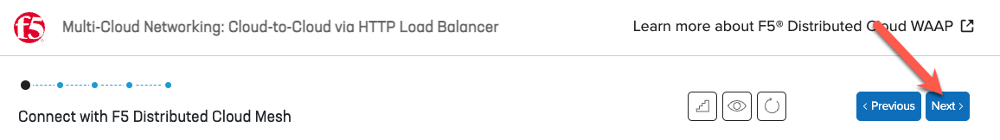
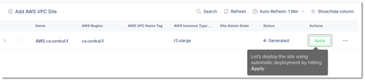

Lab 1: Creating a Site (Simulator)
==================================

F5 Simulators
-------------

F5 provides "simulations" of its services via "F5 Simulators". We will first use the Distributed Cloud Simulator to familiarize you with the environment. Later in the lab we will make use of a shared lab environment that will let you interact with a "live" system.

Exercise #1
-----------

Please visit: https://simulator.f5.com/s/cloud2cloud_via_httplb/nav/sim1/020/0

Note that you will need to pay attention for fields that are highlighted. Some of them like "Show Advanced Fields" may appear on the bottom right of the screen.

You can opt to fill in the form fields or you can click on the "Next" button to allow the simulator to fill-in the fields as required. Note that all of these actions can also be performed via the Distributed Cloud API.

You will simulate creating an AWS Site, then hit "Apply".

Then you will simulate creating an Azure Site. Stop when you reach the step of clicking on "Apply" after creating your Azure Site.

Congratulations you just simulated deploying your AWS Site and Azure Site via the Distributed Cloud Console. In the next Lab Exercise we will be creating Load Balancer resources in the "Live" lab environment.

Next
----

  - **[Module 2: Create Load Balancer Resources](../module2)**
