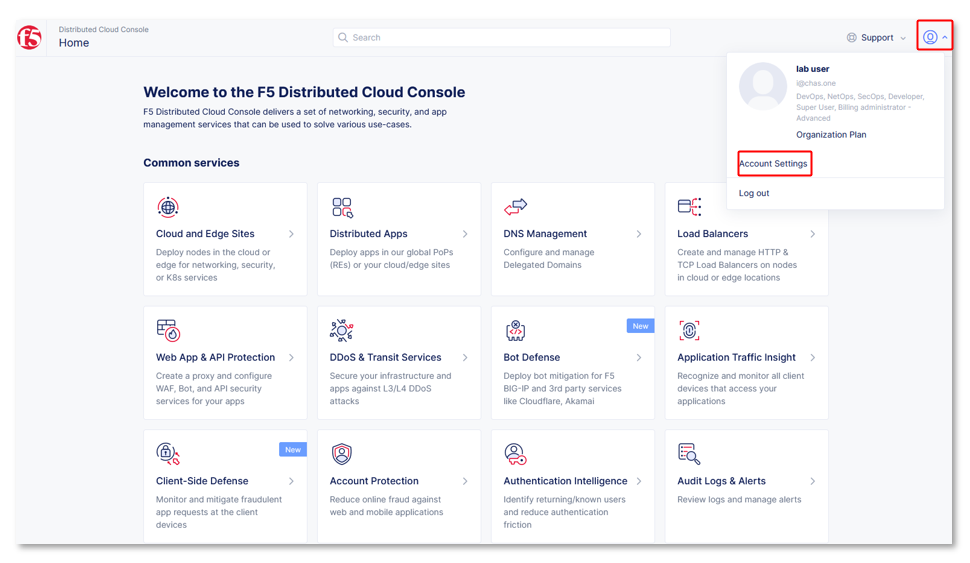
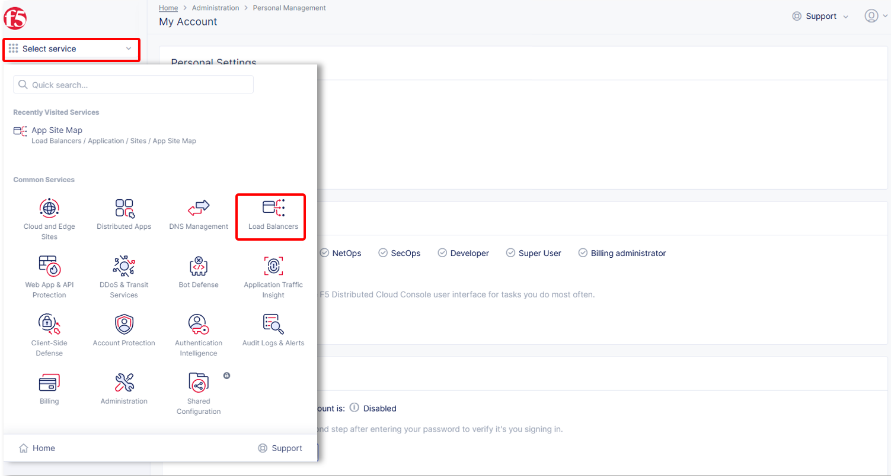
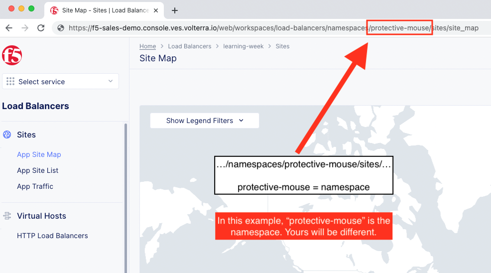

Lab 1: Access the Shared Lab Environment
========================================

Open the UDF Blueprint ["Q2 Learning Week - F5 XC MCN Intro"](https://udf.f5.com/b/1129c8fa-38c9-425d-bbaa-a6e3e15ee13d#documentation) and click "Deploy" to create a deployment. Then hit "Start".

> *Once you start the UDF deployment, it will create an ephemeral account on the F5 Distributed Cloud console (this may take 5-10 min). Then you will receive an email to update your password.*

1. Login to your assigned Distributed Cloud tenant. https://f5-sales-demo.console.ves.volterra.io

2. When you first login you will need to select your "persona". Enter your persona as "NetOps" and level as "Intermediate".

3. Several tooltips will appear. You can close these out.

4. Click on "Account Settings" by expanding the "Account" icon in the top right of the screen and clicking on "Account Settings". In the resulting window you can observe the **Work domains and skill level** section and other administrative functions.

> *For the purposes of this lab, permissions have been restricted to lab operations. As a result, some menus will be locked and not visible.*

Namespaces, which provide an environment for isolating configured applications or enforcing role-based access controls, are leveraged within the F5 Distributed Cloud Console.

> *For the purposes of this lab, each lab attendee has been provided a unique **namespace** which you will be defaulted to (in terms of GUI navigation) for all tasks performed through the course of this lab.*

5. Click on the **Select Service** in the left-hand navigation. In the resulting fly out navigation, click **Load Balancers**.

6. In the **Load Balancers** configuration screen observe the URL. In the URI path, locate the **\<adjective-animal\>** namespace that you have been assigned. It will be located in the portion of the URI path between */namespaces/* and */sites/* as shown in this example **…/namespaces/\<namespace\>/sites/…**. Note the namespace as it will be used throughout the remaining lab tasks.

> *Administratively, there are other ways to find namespaces. Due to access and permission restrictions for this particular lab, those menus are not available.*

Next
----

  - **[Lab 2: Create HTTP Load Balancer](lab2.md)**
  - **[Lab 3: Create TCP Load Balancer](lab3.md)**
  - **[Lab 4: Video Walk-Through (Optional)](lab4.md)**
