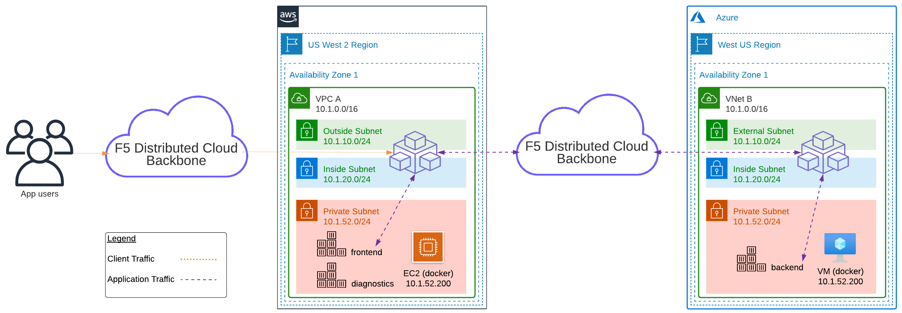

Lab 2: Create HTTP Load Balancer
================================

In this lab exercise you will create an HTTP Load Balancer that allows you to access the public AWS "frontend" application and explore the AWS environment. You also connect to a private AWS EC2 instance via a secure tunnel through an F5 Distributed Cloud Mesh node, which exposes a "diagnostics" app to simulate an internal AWS client. The "diagnostics" app will be used in the next lab to connect to the Azure "backend".

You will complete the following tasks:
- Create an origin pool for the AWS "frontend"
- Create an HTTP Load Balancer and expose the "frontend" on F5 Distributed Cloud's Regional Edge
- Test "frontend" URL with web browser
- Modify the origin pool with the private IP of the AWS "diagnostics"
- Test "diagnostics" URL with web browser
- Review Monitoring and Analytics

*Logical Traffic Flow*
1. Client connects to HTTP LB deployed in Regional Edge
2. Connection forwarded to AWS "frontend"
3. AWS "frontend" connects to Azure "backend" via TCP LB deployed in AWS site

Regional Edge
---------------------------------------------------

A Regional Edge (RE) is part of the F5 Distributed Cloud Global Network and provides connectivity to services. Previously when you deployed the AWS and Azure sites (via F5 Simulator), those are considered "Customer Edge (CE)" sites running on [F5 Nodes](https://docs.cloud.f5.com/docs/ves-concepts/site). The CE communicates with the RE via IPSEC/SSL tunnels (redundant), and each CE is associated with 2x RE for redundancy.

Exercise 1:  Public Origin Pool
---------------------------------------------------
The first task is to create an Origin Pool that refers to the "frontend" application service running in the AWS site.

1. Using the Distributed Cloud Console, switch to the "Load Balancers" context. It can be access either from the Home page or an internal page.

2. On the left menu, go to "Manage"->"Load Balancers"->"Origin Pools". Click "Add Origin Pool".

3. Enter the following variables:

| Variable | Value |
| --- | --- |
| Name | frontend-public |

4. Click on "Add Item" under Origin Servers.

5. Enter the following information:

| Variable | Value |
| --- | --- |
| Select Type of Origin Server | Public DNS Name of Origin Server (default) |
| DNS Name | ec2-52-24-25-72.us-west-2.compute.amazonaws.com |

6. Click "Apply" to return to the previous screen.
7. Enter "80" for the *Port*.
8. Under the *Health Checks* section, click "Add Item".
9. Click the *Health Check object* dropdown list and choose "Add Item".
10. Enter the following variables in the *Metadata* section:

| Variable | Value |
| --- | --- |
| Name | http |

11. Under *HTTP HealthCheck*, click "View Configuration".
12. Leave the default values and click "Apply" to exit the *Health Check HTTP Request Parameters* dialogue.
13. Click "Continue" to return to the *Origin Pool* configuration.
14. Click "Save and Exit" to create the Origin Pool.

Exercise 2: HTTP Load Balancer Configuration
---------------------------------------------------

1. On the left menu, go to "Manage"->"Load Balancers"->"HTTP Load Balancers". Click "Add HTTP Load Balancer".

2. Enter the following variables:

*Note: Replace the host **\<adjective-animal\>** with your namespace (found in "Account Settings"...see [Module2>Lab1](lab1.md))*

| Variable | Value |
| --- | --- |
| Name | frontend |
| Domains | ***\<adjective-animal\>***.sales-demo.f5demos.com |
| Select type of Load Balancer | HTTP |
| Automatically Manage DNS Records | Yes/Check |

> My demo ephemeral namespace is "***protective-mouse***". Therefore my full domain is "***protective-mouse***.sales-demo.f5demos.com".

3. Under the *Origin Pools* section, click "Add Item".
4. The method for "Select Origin Pool Method" should be "Origin Pool". Under the "Origin Pool" dropdown menu, select the "fronted-public" you created earlier.
5. Click "Apply" to exit the *Origin Pool with Weight and Priority* dialogue.
6. Back in the *HTTP Load Balancer* creation menu, scroll down to the section *Other Settings*.
7. The value "Internet" has been selected by default under "VIP Advertisement".

8. Click "Save and Exit" to create the HTTP Load Balancer.

Once the HTTP Load Balancer has been deployed, you can use a web browser to access the AWS "frontend". The FQDN used in our example is http://protective-mouse.sales-demo.f5demos.com. Your FQDN should follow the format of ***[unique-name]***.sales-demo.f5demos.com.

The public demo app should look like the following:

In this topology, you are sending traffic to an AnyCast IP that is hosted in the F5 Distributed Cloud RE. The RE communication to the AWS "frontend" origin pool is via the AWS instance's Public IP address over the Internet.

Exercise 3: Private Origin Pool
---------------------------------------------------

In this exercise, you will create a new origin pool that contains the private AWS resource "diagnostics" app. You will demonstrate how to securely connect to the private AWS resource with an F5 Distributed Cloud Mesh node running in the AWS site.

> Pay attention to the IP addressing in the AWS site. Notice the 10.0.0.0/16 address space as this might be a problem later when you try to add Azure into the traffic flow.

1. On the left menu, go to "Manage"->"Load Balancers"->"Origin Pools". Click "Add Origin Pool".

2. Enter the following variables in the *Metadata* section:

| Variable | Value |
| --- | --- |
| Name | frontend-private |

3. Click on "Add Item" under Origin Servers.

| Variable | Value |
| --- | --- |
| Select Type of Origin Server | IP address of Origin Server on given Sites |
| IP | 10.1.52.200 |
| Site | system/q2lw-aws-c8e4 |
| Select Network on the site | Inside Network |

4. Click "Apply" to return to the previous screen.
5. Enter "8080" for the *Port*.
6. Under the *Health Checks* section, click "Add Item".
7. Click the *Health Check object* dropdown list and choose "Add Item".
8. Enter the following variables in the *Metadata* section:

| Variable | Value |
| --- | --- |
| Name | http-diag |

9. Under *HTTP HealthCheck*, click "View Configuration".
10. Enter "/diag" for *Path*.
11. Click "Apply" to return to the previous screen.
12. Click "Continue" to return to the *Origin Pool* configuration.
13. Click "Save and Exit" to create the Origin Pool.

Exercise 4: Edit HTTP Load Balancer Configuration
---------------------------------------------------

1. On the left menu, go to "Manage"->"Load Balancers"->"HTTP Load Balancers". Click the "..." next to the HTTP LB that you previously created.

2. Click "Manage Configuration".
3. In the upper right, click "Edit Configuration".
4. Under *Origins*, click *the pencil icon* under the "Actions" column to modify your origin pool.
5. Replace the origin pool "frontend-public" with the new origin pool "frontend-private".
6. Click "Apply" to return to the previous screen.
7. Click "Save and Exit" to save the HTTP LB changes.
8. Refresh the browser window for your URL ("http://***\<adjective-animal\>***.sales-demo.f5demos.com").

You now have access to the "diagnostics" app running inside the AWS environment. You will use this in later labs to explore and run tests as an "internal client". For the purposes of this demo, the "diagnostics" app can be considered a jumphost.

Exercise 5: Review General Monitoring Stats
---------------------------------------------------

In the previous section, you demonstrated how to securely connect from the Internet to private resources inside your AWS site. The best part...no special public cloud provider knowledge was required! Next, you will review the built-in analytics of F5 Distributed Cloud platform.

> Note: Explore!

1. On the left menu, go to "Virtual Hosts"->"HTTP Load Balancers" and click "Performance Monitoring" under the "frontend" HTTP LB.

2. Review statistics on the *Dashboard* screen. Change the ***clock*** time filter in the upper right if needed (example "Last 1 hour").

3. Click the *Request* tab to see the URL requests.

4. Expand a request to see more details like full HTTP request, user agent, site location, and more.

