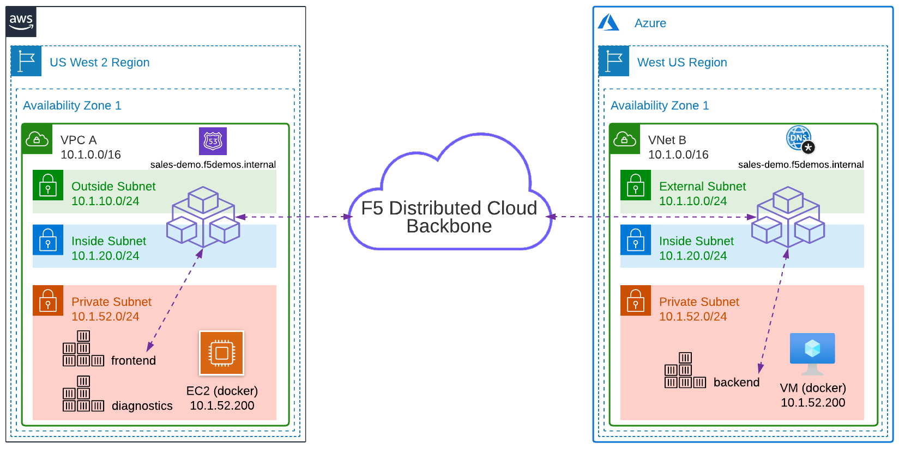

Lab 3: Create TCP Load Balancer
===============================

One of the requirements from the "Narrative" is to enable the AWS "frontend" application to communicate with the Azure "backend" application. You will create an F5 Distributed Cloud TCP Load Balancer resource to allow secure communication between the two services. The TCP LB will be configured with an internal DNS domain name and only available on the AWS site. The F5 Distributed Cloud Mesh will host a Virtual IP (VIP) running the TCP Load Balancer that will proxy traffic to the Azure "backend" application.

In addition, there is a small networking problem. The AWS application is running in a network with 10.1.52.0/24 address space. The Azure application is ***also*** running in a network with 10.1.52.0/24 address space. Unfortunately the AWS and Azure cloud teams did not plan the design properly resulting in networks with IP overlap. You can easily solve this with F5 Distributed Cloud nodes.

You will complete the following tasks:
- Validate DNS from the AWS "diagnostics" app
- Create an Origin Pool for the Azure "backend"
- Create a TCP Load Balancer and expose the "backend" on F5 Distributed Cloud AWS site
- Validate DNS again from the AWS "diagnostics" app
- Connect to the Azure "backend" from the AWS "diagnostics" app



> For this demo, the internal DNS zone ***sales-demo.f5demos.internal*** has been pre-built in each public cloud environment. The zone is configured to forward all requests to the F5 Distributed Cloud node.

*Logical Traffic Flow*
1. "frontend" performs a DNS lookup for "backend"
2. DNS resolves to the inside interface of the AWS F5 node
3. "frontend" connects to the inside interface of the AWS F5 node
4. Connection is forwarded to the Azure F5 node via the F5 Distributed Cloud Global Network
5. Azure F5 node connects via inside interface to the "backend" on a private subnet

Exercise 1: Verify DNS
---------------------------------------------------

In the previous lab exercise, you made a "In Container Diagnostic Services" service available. This is small application that allows you to run tools to verify DNS and run commands like "curl" to simulate HTTP/HTTPS connections from inside the AWS environment.

1. Reopen the browser window for your URL ("http://***\<adjective-animal\>***.sales-demo.f5demos.com"). It will open the "diagnostics" app.
2. Click "DNS Lookup".
3. Enter "ip-10-1-52-200.us-west-2.compute.internal" in the *target* field.
4. Click "Lookup".

```
   ; <<>> DiG 9.16.1-Ubuntu <<>> @127.0.0.53 ip-10-1-52-200.us-west-2.compute.internal A
   ; (1 server found)
   ;; global options: +cmd
   ;; Got answer:
   ;; ->>HEADER<<- opcode: QUERY, status: NOERROR, id: 21780
   ;; flags: qr rd ra; QUERY: 1, ANSWER: 1, AUTHORITY: 0, ADDITIONAL: 1

   ;; OPT PSEUDOSECTION:
   ; EDNS: version: 0, flags:; udp: 65494
   ;; QUESTION SECTION:
   ;ip-10-1-52-200.us-west-2.compute.internal. IN A

   ;; ANSWER SECTION:
   ip-10-1-52-200.us-west-2.compute.internal. 60 IN A 10.1.52.200

   ;; Query time: 4 msec
```

The last step was a basic DNS test to simply illustrate that the "diagnostics" app running in AWS can do a DNS query and receive an answer. The *target* value was the AWS EC2 instance private DNS name, and the answer is the private IP address of the AWS instance. Next, you will verify that there is not yet a DNS record for ***\<adjective-animal\>***.sales-demo.f5demos.internal.

5. Refresh your browser window.
6. Click "DNS Lookup".
7. Enter "***\<adjective-animal\>***.sales-demo.f5demos.internal" in the *target* field.

*Note: Replace the host **\<adjective-animal\>** with your namespace (found in "Account Settings"...see [Module2>Lab1](lab1.md))*

8. Click "Lookup".

```
   ; <<>> DiG 9.16.1-Ubuntu <<>> @127.0.0.53 protective-mouse.sales-demo.f5demos.internal A
   ; (1 server found)
   ;; global options: +cmd
   ;; Got answer:
   ;; ->>HEADER<<- opcode: QUERY, status: SERVFAIL, id: 36141
   ;; flags: qr rd ra; QUERY: 1, ANSWER: 0, AUTHORITY: 0, ADDITIONAL: 1

   ;; OPT PSEUDOSECTION:
   ; EDNS: version: 0, flags:; udp: 65494
   ;; QUESTION SECTION:
   ;protective-mouse.sales-demo.f5demos.internal. IN A

   ;; Query time: 24 msec
```

You should receive an error and "SERVFAIL" that indicates the name does not exist.

Exercise 2: Create Backend Origin Pool
---------------------------------------------------

In this exercise, you will create a new Origin Pool that contains the Azure "backend".

1. On the left menu, go to "Manage"->"Load Balancers"->"Origin Pools". Click "Add Origin Pool".


2. Enter the following variables in the *Metadata* section:

| Variable | Value |
| --- | --- |
| Origin Pool Name | backend |

3. Click on "Add Item" under Origin Servers.

4. Enter the following information:

| Variable | Value |
| --- | --- |
| Select Type of Origin Server | IP address of Origin Server on given Sites |
| IP | 10.1.52.200 |
| Site | system/q2lw-azure-c8e4 |
| Select Network on the site | Inside Network |


> Notice the 10.1.52.200 IP overlap!!!

5. Click "Apply" to return to the previous screen.
6. Enter "80" for the *Port*.
7. Under the *Health Checks* section, click "Add Item".
8. Click the *Health Check object* dropdown list and choose "Add Item".
9. Enter the following variables in the *Metadata* section:

| Variable | Value |
| --- | --- |
| Name | tcp |
| Health Check | TCP HealthCheck |

10. Click "Continue".
11. Click "Save and Exit" to create the Origin Pool.

Exercise 3: Create Backend TCP Load Balancer
---------------------------------------------------

In this exercise, you will create an F5 Distributed Cloud TCP Load Balancer for the Azure "backend" with an internal domain name and only accessible from the AWS site.

1. On the left menu, go to "Manage"->"Load Balancers"->"TCP Load Balancers". Click "Add TCP Load Balancer".


2. Click "Add Item" in the *Basic Configuration* section.

3. Enter the following information:

| Variable | Value |
| --- | --- |
| Name | backend |
| Domains | ***\<adjective-animal\>***.sales-demo.f5demos.internal |
| Listen Port | 80 |
| SNI and Default LB choice | No SNI |
| Automatically Manage DNS Records | No/Uncheck |
| Where to Advertise the VIP | Advertise Custom |

> My demo ephemeral namespace is "***protective-mouse***". Therefore my private domain is "***protective-mouse***.sales-demo.f5demos.internal".

4. Under the *Origin Pools* section, click "Add Item".
5. The method for "Select Origin Pool Method" should be "Origin Pool". Under the "Origin Pool" dropdown menu, select the "backend" you created earlier.
6. Click "Apply" to return to the previous screen.
7. Under *Advertise Custom*, click "Configure".
8. Click "Add Item".
9. Enter the following information:

| Variable | Value |
| --- | --- |
| Name | backend |
| Select Where to Advertise | Site |
| Site Network | Inside Network |
| Site Reference | system/q2lw-aws-c8e4 |


> Note: This is only advertised on the AWS site.

10. Click "Apply" to return to the previous screen.
11. Click "Apply" again to return to *TCP Load Balancer* configuration page.


12. Click "Save and Exit" to create the TCP Load Balancer.

Exercise 4: Verify DNS Again
---------------------------------------------------

The F5 Distributed Cloud gateway provides a recursive DNS resolver. You can either point a client directly at the gateway or forward DNS queries that you would like F5 Distributed Cloud nodes to process.

> For this demo, the internal DNS zone ***sales-demo.f5demos.internal*** has been pre-built in each public cloud environment. The zone is configured to forward all requests to the F5 Distributed Cloud node.

1. Reopen the browser window for your URL ("http://***\<adjective-animal\>***.sales-demo.f5demos.com"). It will open the "diagnostics" app.
2. Click "DNS Lookup".
3. Enter "***\<adjective-animal\>***.sales-demo.f5demos.internal" in the *target* field.

*Note: Replace the host **\<adjective-animal\>** with your namespace (found in "Account Settings"...see [Module2>Lab1](lab1.md))*

4. Click "Lookup".

```
   ; <<>> DiG 9.16.1-Ubuntu <<>> @127.0.0.53 protective-mouse.sales-demo.f5demos.internal A
   ; (1 server found)
   ;; global options: +cmd
   ;; Got answer:
   ;; ->>HEADER<<- opcode: QUERY, status: NOERROR, id: 5847
   ;; flags: qr rd ra; QUERY: 1, ANSWER: 1, AUTHORITY: 0, ADDITIONAL: 1

   ;; OPT PSEUDOSECTION:
   ; EDNS: version: 0, flags:; udp: 65494
   ;; QUESTION SECTION:
   ;protective-mouse.sales-demo.f5demos.internal. IN A

   ;; ANSWER SECTION:
   protective-mouse.sales-demo.f5demos.internal. 300 IN A 10.1.20.39

   ;; Query time: 0 msec
```

You should no longer get an error. In this example, the domain name "protective-mouse.sales-demo.f5demos.internal" resolves internally to the IP address of the F5 Distributed Cloud node internal interface.

Exercise 5: Connect to the Backend
---------------------------------------------------

In this exercise, you will emulate how a distributed application can access a resource that resides in another remote network via the F5 Distributed Cloud Global Network.

1. Reopen the browser window for your URL ("http://***\<adjective-animal\>***.sales-demo.f5demos.com"). It will open the "diagnostics" app.
2. Click on "Run Command".
3. Enter "curl -s http://***\<adjective-animal\>***.sales-demo.f5demos.internal" in the field.

*Note: Replace the host **\<adjective-animal\>** with your namespace (found in "Account Settings"...see [Module2>Lab1](lab1.md))*

4. Click on "Run Command".

```
   ================================================
    ___ ___   ___                    _
   | __| __| |   \ ___ _ __  ___    /_\  _ __ _ __
   | _||__ \ | |) / -_) '  \/ _ \  / _ \| '_ \ '_ \
   |_| |___/ |___/\___|_|_|_\___/ /_/ \_\ .__/ .__/
                                         |_|  |_|
   ================================================

         Node Name: Q2 Learning Week (Azure)
        Short Name: q2lw-webserver-c8e4

         Server IP: 10.1.52.200
       Server Port: 80

         Client IP: 10.1.20.4
       Client Port: 51226

   Client Protocol: HTTP
    Request Method: GET
       Request URI: /

       host_header: protective-mouse.sales-demo.f5demos.internal
        user-agent: curl/7.68.0

   command completed with return code:0
```

You will see an output and node name of "Q2 Learning Week (Azure)". This is the "backend" application. Also pay attention to the "host_header" value at the bottom with full name. Next, try repeating the same command with the private IP address of the F5 Distributed Cloud node. This is the IP address you retrieved in Exercise 4.

5. Click on "Run Command".
6. Enter "curl -s http://10.1.20.39".
7. Click on "Run Command".

```
   ================================================
    ___ ___   ___                    _
   | __| __| |   \ ___ _ __  ___    /_\  _ __ _ __
   | _||__ \ | |) / -_) '  \/ _ \  / _ \| '_ \ '_ \
   |_| |___/ |___/\___|_|_|_\___/ /_/ \_\ .__/ .__/
                                         |_|  |_|
   ================================================

         Node Name: Q2 Learning Week (Azure)
        Short Name: q2lw-webserver-c8e4

         Server IP: 10.1.52.200
       Server Port: 80

         Client IP: 10.1.20.4
       Client Port: 51272

   Client Protocol: HTTP
    Request Method: GET
       Request URI: /

       host_header: 10.1.20.39
        user-agent: curl/7.68.0

   command completed with return code:0
```

The previous test will also be successful. However if the load balancer resources were configured to use SNI, then the previous test would result in an error. This is because F5 Distributed Cloud would be expecting an SNI value. As a result, this allows you to re-use the same IP address for multiple different services using Host Header or SNI values.

Summary
---------------------------------------------------

This concludes the lab, and you have successfully demonstrated how to solve Multi-Cloud Networking with the use of F5 Distributed Cloud. This lab utilized layer 7 application technology like HTTP and TCP Load Balancers to establish connectivity to remote networks. You setup a "frontend" app running in AWS and securely connected to the "backend" app running in Azure. At the same time, you illustrated that IP overlap can be solved by deploying and using F5 Distributed Cloud nodes in customer networks.

It is also possible to use layer 3 networking over the F5 Distributed Cloud Global Network to provide routed connectivity between networks (requires non-overlapping IP addresses). If you are interested in learning more about Global Networks, you can use the following Distributed Cloud simulator: https://simulator.f5.com/s/cloud2cloud_via_sites

Thank you for completing the lab!
